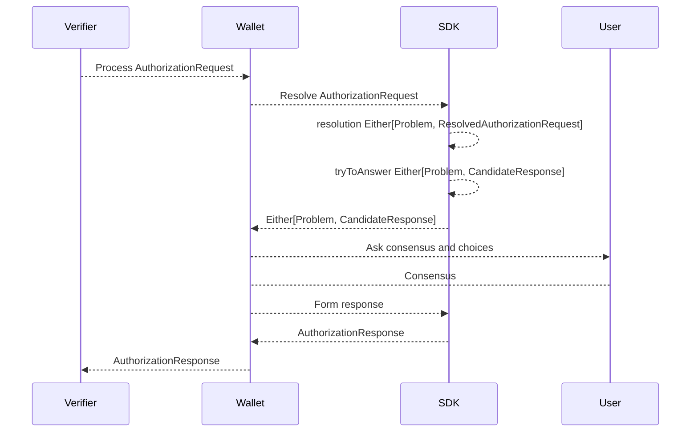
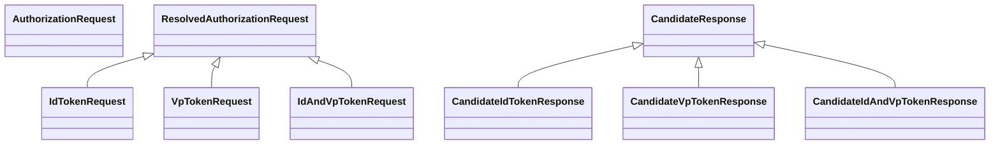

# SIOPv2 & OpenID4VP flows

## Functionality in scope

On a high level the functions that need to be supported by wallet

1. Issuance of a self-attested  `id-token`
2. Presentation of a verifiable credential `vp-token`
3. Combination of the two above

